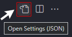

<h1 align="Center">
    Change specific items of a Theme in VSCode
</h1>



- First, open ``Settings`` in VSCode (Hotkey: ``CTRL / CMD + ,``)
- Click on the button in the right upper corner to open up ``settings.json``
- Then add your changes in the color (examples further down below)

The changes will effect **all** color Themes!

<h2 align="center">
    Examples:
</h2>

If not already, you need to add ``"editor.tokenColorCustomizations": {}`` anywhere in the file.
There are variations of commands, to change the syntax colors!

To change the color of strings:
```json
"editor.tokenColorCustomizations": {
    "strings": "#12a95c",
},
```

To change the color of comments:
```json
"editor.tokenColorCustomizations": {
    "comments": "#12a95c",
},
```
<br><br>

### For the following codes, we will always be in the ``"textMateRules``:

```json
"editor.tokenColorCustomizations": {
    "textMateRules": [
        {
            "scope": "entity.tag.name", // change this to whatever needed.
            "settings": {
                "foreground": "#12a95c" // change the color to whatever needed.
            }
        },
    ]
```
<br>
To change the color of quotation marks:
```json
{
    "scope": "punctuation.definition.string.begin",
    "settings": {
        "foreground": "#12a95c"
    }
},
{
    "scope": "punctuation.definition.string.end",
    "settings": {
        "foreground": "#12a95c"
    }
},
```

To change the color of classes in css (``.body``, etc.)
```json
{
    "scope": "entity.other.attribute-name.class.css",
    "settings": {
        "foreground": "#05a1f7"
    }
},
```

To change the color of id's in css (``#body``, etc.)
```json
{
    "scope": "entity.other.attribute-name.id.css",
    "settings": {
        "foreground": "#05a1f7"
    }
},
```


To change the color of classes in html
```json
{
    "scope": "entity.other.attribute-name",
    "settings": {
        "foreground": "#05a1f7"
    }
},
```

To change the color of pseudo-elements in css (``::placeholder``, etc.)
```json
{
    "scope": "entity.other.attribute-name.pseudo-element",
    "settings": {
        "foreground": "#49AEE6"
    }
},
```

To change the color of pseudo-classes in css (``:hover``, etc.)
```json
{
    "scope": "entity.other.attribute-name.pseudo-class",
    "settings": {
        "foreground": "#49AEE6"
    }
},
```

To change the color of numbers (in css, for example)
```json
{
    "scope": "constant.numeric",
    "settings": {
        "foreground": "#47d4b9"
    }
},
```

To change the color of units in css (``px``, ``rem``, etc.)
```json
{
    "scope": "keyword.other.unit",
    "settings": {
        "foreground": "#47d4b9"
    }
},
```

To change the color of (constant) rgb/hex-values (``#fffff``, etc.)
```json
{
    "scope": "constant",
    "settings": {
        "foreground": "#47d4b9"
    }
},
```
To change the color of ``#`` in css, etc.
```json
{
    "scope": "punctuation.definition.constant",
    "settings": {
        "foreground": "#47d4b9"
    }
},
```
